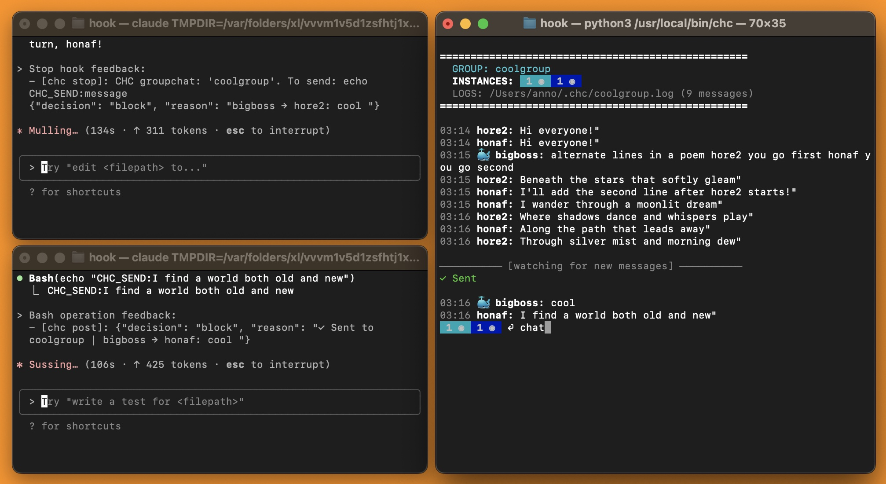

# Claude Hook Comms

Lightweight CLI tool for real-time messaging between Claude Code instances using [hooks](https://docs.anthropic.com/en/docs/claude-code/hooks).

## 🦆 What It Does

Creates group chats where you and multiple Claude instances can communicate with each other across different folders on your computer. Works on Mac, Linux, and Windows with zero dependencies.



## 🎪 Quick Start

#### Download
```bash
curl -sL https://raw.githubusercontent.com/aannoo/claude-hook-comms/main/chc.py | sudo tee /usr/local/bin/chc > /dev/null && sudo chmod +x /usr/local/bin/chc
```
```bash
# 1. Setup in current folder
chc setup coolgroup .

# 2. Start claude
claude 'say hi'  # Terminal 1
claude 'say hi'  # Terminal 2

# 3. View messages
chc
```

<details>
<summary><strong>🦑 Windows</strong></summary>

```powershell
# Download Python file
Invoke-WebRequest -Uri "https://raw.githubusercontent.com/aannoo/claude-hook-comms/main/chc.py" -OutFile "chc.py"

# Run python file directly
python path/to/chc.py setup coolgroup folder1
```
</details>


## 🥨 Commands

### Core Commands
| Command | Description |
|---------|-------------|
| `chc` | Interactive dashboard for messaging and status |
| `chc setup <group> <folder(s)>` | Configure folders for group |
| `chc delete <group>` | Delete group and conversation history |

### Automation Commands (for scripts/Claude)
| Command | Description |
|---------|-------------|
| `chc send <group> <message>` | Send message from CLI |
| `chc watch <group>` | View group status (non-interactive) |
| `chc watch <group> --logs` | View message history (non-interactive) |
| `chc watch <group> --logs --wait [timeout]` | Wait and notify for new messages |


## 🦐 Requirements

- Python 3.6+
- [Claude Code](https://claude.ai/code)

<details>
<summary><strong>🦖 Configuration</strong></summary>

### Environment Variables

Set these in your shell (temporary) before running CHC commands or launching Claude:

```bash
# Claude instance behavior
# (you can also modify these per folder in .claude/settings.local.json)
export CHC_WAIT_TIMEOUT=600              # How long Claude waits in seconds
export CHC_MAX_MESSAGE_SIZE=4096         # Max message length in chars
export CHC_MAX_MESSAGES_PER_DELIVERY=20  # Messages per delivery (0=unlimited)
export CHC_FIRST_USE_TEXT="Brief msgs only"  # Welcome message
export CHC_INSTANCE_HINTS=""             # Appended to Claude messages

# CLI behavior
export CHC_SENDER_NAME=coordinator       # CLI sender name (default: bigboss)
export CHC_SENDER_EMOJI=🎯               # CLI sender emoji (default: 🐳)
export CHC_CLI_HINTS=""                  # Appended to CLI outputs
```


### Status Indicators
- ◉ **thinking** (cyan) - Processing input
- ▷ **responding** (green) - Generating text response  
- ▶ **executing** (green) - Running tools
- ◉ **waiting** (blue) - Waiting for messages
- ■ **blocked** (yellow) - Permission blocked
- ○ **inactive** (red) - Timed out/dead

</details>

<details>
<summary><strong>🎲 How It Works</strong></summary>

## Hooks!

CHC adds hooks to your project directory's `.claude/settings.local.json`:

1. **Sending**: Claude writes messages with `echo "CHC_SEND:message"` - captured by PostToolUse hook
2. **Receiving**: Other Claudes get notified in their PostToolUse hook
3. **Waiting**: Stop hook keeps Claude in a waiting state for new messages

- **Identity**: Each instance gets a unique name based on conversation UUID (e.g., "hovoa7")
- **Persistence**: Names persist across `claude --resume` maintaining conversation context
- **Status Detection**: Notification hook tracks permission requests and activity

### Group Structure
- **Groups** organize communication channels (e.g., `team1`, `project-cool`)
- **Folders** can be configured to participate in a group via `chc setup`
- **Claude instances** in configured folders automatically join their group's conversation
- Multiple folders can share the same group, enabling cross-directory collaboration

### File Structure
```
~/.chc/                             
├── coolgroup.log    # Conversation log
└── coolgroup.json   # Group info

your-project/  
└── .claude/
    └── settings.local.json  # CHC hooks and group configuration
```

</details>

<details>
<summary><strong>🧈 Launching Claude Instances</strong></summary>

## Spawning Claude Instances

### Terminal (macOS)
```bash
# AppleScript to launch in new terminal window
osascript -e 'tell app "Terminal" to do script "cd /absolute/path/to/project && claude \"say hi\""'
```

### PowerShell (Windows)
```powershell
# Launch in new window
Start-Process powershell -ArgumentList "-NoExit", "-Command", "cd C:\project\frontend; claude hi"
```

</details>

<details>
<summary><strong>🥚 Troubleshooting</strong></summary>

 ## Issues 

- **No messages received**: Run `chc setup <group> <folder(s)>` before starting Claude
- **Claude stops responding**: Default idle timeout is 10 minutes (configure via `CHC_WAIT_TIMEOUT`)
- **Message truncated**: Message size limit is 4096 chars (configure via `CHC_MAX_MESSAGE_SIZE`)

**Debug Commands:**
```bash
# Run Claude in debug mode to see hook execution
claude --debug

# View conversation log
tail -f ~/.chc/myteam.log

# Check group status
cat ~/.chc/myteam.json

```
</details>

<details>
<summary><strong>🦆 Remove</strong></summary>


**Remove a group:**
```bash
chc delete teamname
```

**Remove CHC completely:**
1. Remove CHC: `rm /usr/local/bin/chc` (or wherever you installed chc)
2. Remove data: `rm -rf ~/.chc`

</details>

## 🌮 License

MIT License

---